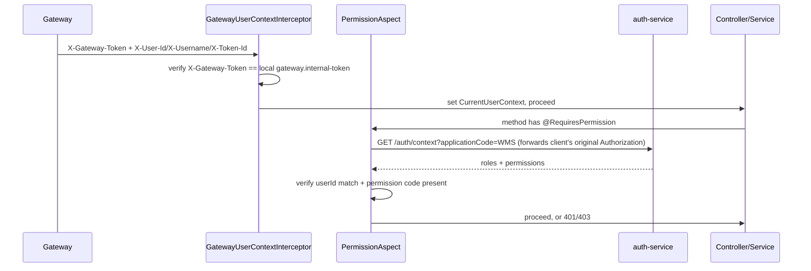
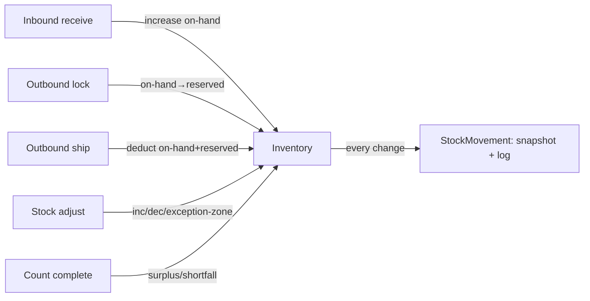

# Project Context

> Navigation + architecture + critical facts only. Implementation details live in source code.
> Last verified: 2026-08-11 (code + a live query against the running Nacos instance + a live query against the running pgvector container + a live query against auth-service's MySQL `auth` database).
> This repo's `README.md`/`CLAUDE.md` and the sibling `../WMS-README.md` previously had architecture descriptions that predated the Gateway/auth-service/Nacos migration — those have since been corrected in place (2026-08-10). If you find another stale claim, fix it the same way rather than trusting it.

## 1. Project Responsibility

`wms-system` (Nacos service name `wms-service`, runnable module `wms-admin`) is the core WMS business service.

**Owns:** everything under "WMS Business Boundary" below (warehouse/inventory/inbound/outbound/adjust/count/exceptions/dict/operation-log/AI-RAG).

**Does NOT own:** user accounts, roles, permissions, or authentication — those are auth-service's. Request routing — that's Gateway's.

**Exception to be aware of:** the repo still physically contains a full local RBAC implementation (`SysUser`/`SysRole`/`SysPermission`) and a local login endpoint. These are disabled by default and documented as historical — see §14. Don't treat their presence as evidence WMS owns identity/permissions.

## 2. Runtime

| Item | Value | Source |
|---|---|---|
| Application Name | `wms-service` (**note**: differs from the repo dir name `wms-system` and the DB name `wms_system`) | `wms-admin/src/main/resources/application.yml` |
| Port | **8083** | same |
| Context Path | `/wms` | same |
| Nacos Service Name | `wms-service` | same |
| Database | MySQL `wms_system` (`jdbc:mysql://localhost:3306/wms_system`) + PostgreSQL/pgvector `wms_ai` (`jdbc:postgresql://localhost:5433/wms_ai`, AI/RAG only) | confirmed via Nacos `wms-service-dev.yaml`/`WMS_GROUP` — **not** in any file in this repo, see §11 |
| External Dependencies | MySQL, Nacos, auth-service (permission context), pgvector + Ollama + DeepSeek (AI only) | see §9 |
| Startup | reactor root `wms-system/`: `mvn -pl wms-admin -am spring-boot:run` | `README.md` §6 |

Matches system convention (WMS = 8083). **No CONFIGURATION CONFLICT on port.** (There *was* a real conflict on where the datasource config lives — repo docs used to claim a local `application-dev.yml` that doesn't exist; resolved, see §16 history.)

**Operational note:** as of 2026-08-10, `docker ps` shows no running container for this service (unlike the other three, which are all up) — don't assume `:8083` is reachable without starting it first.

## 3. Technology Stack

Java 17, Spring Boot 3.3.6 (**note:** older than gateway/auth-service's 3.5.8), Spring MVC, Spring AOP (`@RequiresPermission`, `@SysOperationLog`), MyBatis-Plus 3.5.16 (Snowflake IDs, `@TableLogic` soft delete), MySQL, Flyway (`V1`–`V9`), PostgreSQL + pgvector, Spring AI 1.0.3 (`spring-ai-starter-model-deepseek`, `-model-ollama`, `-pgvector-store`), Spring Cloud Alibaba Nacos, Knife4j/springdoc, Hutool, Lombok.

Not present: Spring Security (auth is custom interceptor + AOP), Redis.

## 4. Project Structure

Maven multi-module; only `wms-admin` has real code (`wms-framework`/`wms-modules` are empty scaffolding; `wms-common` is a small shared lib — `ApiResponse`, `BusinessException`, `GlobalExceptionHandler`, `PageRequest`/`PageResponse`, business enums).

```
wms-admin/src/main/java/com/example/wms/admin/
  controller/          HTTP entry points (base/ = warehouse+customer+sku+supplier+dict+opLog; ai/ = knowledge+RAG; auth/ = historical RBAC, see §14; root = inbound/outbound/inventory/adjust/count)
  service/             business logic, transactions
  model/entity/        MyBatis-Plus entities — NOT anemic: e.g. Inventory.increase()/decrease() carry state-transition logic
  model/mapper/        MyBatis-Plus mappers
  view/dto/            request/response records
  config/              AiVectorStoreConfig, MainDataSourceConfig, MybatisPlusConfig, WebMvcConfig, RagProperties, ...
  security/            GatewayUserContextInterceptor (current), LegacyAdminAccessInterceptor, AuthInterceptor (disabled), JwtTokenService (disabled)
  client/               AuthServiceClient — calls auth-service for permission context
  annotation/ + aspect/ @RequiresPermission + PermissionAspect; @SysOperationLog + SysOperationAspect
```

## 5. Core Capabilities

| Capability | Status | Entry Point | Main Files |
|---|---|---|---|
| Warehouse | ✅ Implemented (full CRUD + enable/disable, added 2026-08-11 — see §13 item 1 for the delete/disable-blocked-by-child-areas guard) | `WarehouseController` | `service/WarehouseService.java` |
| Area / Location | ✅ Implemented (full CRUD) | `WarehouseAreaController`, `WarehouseLocationController` | `service/Warehouse{Area,Location}Service.java` |
| SKU | ✅ Implemented (full CRUD + enable/disable, added 2026-08-11) | `SkuController` | `service/SkuService.java` |
| Supplier | ✅ Implemented (full CRUD + enable/disable, added 2026-08-11) | `SupplierController` | `service/SupplierService.java` |
| Customer | ✅ Implemented (full CRUD + enable/disable) | `CustomerController` | `service/CustomerService.java` |
| Inbound | ✅ Implemented | `InboundOrderController` | `service/InboundOrderService.java` |
| Outbound | ✅ Implemented | `OutboundOrderController` | `service/OutboundOrderService.java` |
| Inventory query + movements | ✅ Implemented | `InventoryController` | `service/InventoryService.java` |
| Stock adjust | ✅ Implemented | `StockAdjustOrderController` | `service/StockAdjustOrderService.java` |
| Stock count | ✅ Implemented | `StockCountTaskController` | `service/StockCountTaskService.java` |
| Exception events | ✅ Implemented (system-raised only, no manual creation) | `WmsExceptionEventController` | `service/WmsExceptionEventService.java` |
| Data dictionary | ✅ Implemented | `SysDictController` | `service/SysDictService.java` |
| Operation log | ✅ Implemented (async) | `SysOperationLogController` | `SysOperationAspect` |
| AI knowledge base + RAG | ✅ Implemented | `KnowledgeController`, `AiRagAskController` | `service/AiRagAskService.java` |
| Gateway identity + permission check | ✅ Implemented (the currently-active auth path) | all `@RequiresPermission` endpoints | `security/GatewayUserContextInterceptor.java`, `aspect/PermissionAspect.java` |
| Local RBAC (user/role/permission mgmt) | ⚪ Skeleton — code complete, **blocked by default (403)** | `Sys(User\|Role\|Permission)Controller` | see §14 |
| Local login/JWT | ⚪ Skeleton — code complete, **blocked by default (410)** | historical `AuthController` | see §14 |

## 6. API Navigation

**Gateway API = `/api` + Service API** (confirmed via `Path=/api/wms/**` + `StripPrefix=1`, see gateway-service PROJECT_CONTEXT.md §6). Computed, not individually load-tested.

| Capability | Method | Gateway API | Service API | Controller |
|---|---|---|---|---|
| Customers | GET/POST/PUT/PATCH/DELETE | `/api/wms/customers` | `/wms/customers` | `CustomerController` |
| SKU | GET/POST/PUT/PATCH/DELETE | `/api/wms/skus`, `.../{id}` | `/wms/skus`, `.../{id}` | `SkuController` |
| Supplier | GET/POST/PUT/PATCH/DELETE | `/api/wms/suppliers`, `.../{id}` | `/wms/suppliers`, `.../{id}` | `SupplierController` — `id` in the body on `PUT`/`PATCH` (Customer/Sku/Warehouse convention), not `/{id}` |
| Warehouse | GET/POST/PUT/PATCH/DELETE | `/api/wms/warehouses`, `.../{id}` | `/wms/warehouses`, `.../{id}` | `WarehouseController` — note: `PUT`/`PATCH` take `id` in the body (Customer/Sku style), **not** `/{id}` in the path like Area/Location below — don't assume this module is internally consistent |
| Area / Location | GET/POST/PUT/PATCH/DELETE | `/api/wms/warehouse-areas`, `/api/wms/warehouse-locations` | drop `/api` | `Warehouse{Area,Location}Controller` — these take `id` as a `/{id}` path segment |
| Inbound | GET/POST/PUT/DELETE | `/api/wms/inbound-orders`, `.../{id}/receive` | drop `/api` | `InboundOrderController` |
| Outbound | GET/POST/PUT/DELETE | `/api/wms/outbound-orders`, `.../lock`, `.../ship`, `.../cancel` | drop `/api` | `OutboundOrderController` |
| Inventory | GET | `/api/wms/inventory`, `/api/wms/inventory/transactions/page` | drop `/api` | `InventoryController` |
| Stock adjust | GET/POST/PUT | `/api/wms/stock-adjust-orders/**` | drop `/api` | `StockAdjustOrderController` |
| Stock count | GET/POST/PUT | `/api/wms/stock-count-tasks/**` | drop `/api` | `StockCountTaskController` |
| Exception events | GET/PATCH | `/api/wms/wms-exceptions/**` | drop `/api` | `WmsExceptionEventController` |
| Data dictionary | GET/POST/PUT | `/api/wms/sys-dicts/**` | drop `/api` | `SysDictController` |
| Operation log | GET | `/api/wms/operation-logs` | drop `/api` | `SysOperationLogController` |
| AI knowledge | GET/POST/PUT/PATCH | `/api/wms/ai/knowledge/**` | drop `/api` | `KnowledgeController` |
| RAG ask | POST | `/api/wms/ai/rag/ask`, `.../ask/stream` | drop `/api` | `AiRagAskController` |
| Historical local login/RBAC | — | `/api/wms/auth/**`, `/api/wms/users/**`, `/api/wms/roles/**`, `/api/wms/permissions/**` | drop `/api` | see §14 — reachable path-wise but blocked (410/403) |

Frontend today consumes `/wms/customers`, `/wms/skus`, `/wms/warehouses`, `/wms/warehouse-areas`, `/wms/warehouse-locations`, `/wms/suppliers`, `/wms/operation-logs`, `/wms/wms-exceptions`, `/wms/inbound-orders`, `/wms/outbound-orders`, `/wms/inventory`, `/wms/inventory/transactions/page`, `/wms/sys-dicts/*`, `/wms/stock-count-tasks`, and `/wms/stock-adjust-orders` (`wms-web-refactor/src/api/customers.js`, `.../api/sku.js`, `.../api/warehouse.js`, `.../api/warehouseArea.js`, `.../api/warehouseLocation.js`, `.../api/supplier.js`, `.../api/operationLog.js`, `.../api/exceptionEvent.js`, `.../api/inboundOrder.js`, `.../api/outboundOrder.js`, `.../api/inventory.js`, `.../api/stockMovement.js`, `.../api/sysDict.js`, `.../api/stockCountTask.js`, `.../api/stockAdjustOrder.js`, all verified field-for-field consistent against the actual DTOs). `WarehouseAreaController`, `WarehouseLocationController`, `SysOperationLogController`, `WmsExceptionEventController`, `InboundOrderController`, `OutboundOrderController`, `InventoryController` (both its `search` and `searchTransactions` endpoints), `StockCountTaskController`, and `StockAdjustOrderController` all already had the exact CRUD/lifecycle surface their frontend pages needed before those pages existed (full CRUD for Area/Location, intentionally read-only / read+mark-handled for OperationLog/Exception/Inventory/StockMovement, full order/task-lifecycle for Inbound/Outbound/StockCount/StockAdjust); `SupplierController` needed the same create+list→full-CRUD extension as SKU/Warehouse (2026-08-11). **Every controller under `controller/base/` and the root business controllers (`InboundOrderController`/`OutboundOrderController`/`InventoryController`/`StockCountTaskController`/`StockAdjustOrderController`) now has a frontend page** — that's the entire basic-data/orders/inventory/system-admin surface this multi-session build-out targeted. `SysDictController` is fully consumed — its `batch` business-read endpoint plus its full admin CRUD (`types`/`items`) via a dedicated dictionary-management page. **Not covered, and out of scope for this build-out:** the AI module (`controller/ai/` — `KnowledgeController`, `AiRagAskController`, `AiRagTestController`) has no frontend page at all; the historical `controller/auth/` controllers (`AuthController`, `SysUserController`, `SysRoleController`, `SysPermissionController`) are deliberately disabled by default and out of scope by design, see §14.

## 7. Data Model Overview

| Entity | Purpose | PK | Key state |
|---|---|---|---|
| `Warehouse` / `WarehouseArea` / `WarehouseLocation` | 3-tier location hierarchy | Snowflake | Location has `status` (enabled/disabled/locked/counting/full) |
| `Sku` / `Customer` / `Supplier` | master data | Snowflake | `enabled` soft-delete |
| `InboundOrder` / `InboundOrderItem` | inbound docs | Snowflake | `CREATED` → `RECEIVED` |
| `OutboundOrder` / `OutboundOrderItem` / `OutboundStockLock` | outbound docs + stock lock allocations | Snowflake | create → lock → ship / cancel |
| `Inventory` | on-hand/reserved/frozen tri-state | composite (warehouse+area+location+sku+status) | `increase()`/`decrease()` on the entity itself |
| `InventorySnapshot` / `StockMovement` | before/after snapshots + the single audit trail for all stock changes | Snowflake | — |
| `StockAdjustOrder` / `StockAdjustOrderItem` | adjustments | Snowflake | `DRAFT` → submit → confirm/cancel |
| `StockCountTask` / `StockCountItem` | counting | Snowflake | open → record → complete/cancel |
| `WmsExceptionEvent` | system-raised business exceptions | Snowflake | handled/unhandled |
| `SysDictType` / `SysDictItem` | dictionary (WMS's own, not RBAC) | Snowflake | — |
| `SysOperationLog` | audit log | Snowflake | async write |
| `KnowledgeDocument` / `KnowledgeChunk` | AI knowledge base (MySQL is primary; pgvector is a rebuildable index) | Snowflake | — |
| `SysUser` / `SysRole` / `SysPermission` / `SysUserRole` / `SysRolePermission` | **historical RBAC, see §14** | Snowflake | not the permission source of truth |

## WMS Business Boundary

**WMS owns:** Warehouse, WarehouseArea, WarehouseLocation, SKU, Customer, Supplier, Inbound, Outbound, Inventory, StockMovement, StockAdjust, StockCount, ExceptionEvent, SysDict, SysOperationLog, AI/RAG.

**Auth owns:** User, Role, Permission, Authentication, Authorization.

**Currently still present in this repo despite belonging to Auth:** `SysUser`/`SysRole`/`SysPermission`/`SysUserRole`/`SysRolePermission` and a local login controller. **Classification: Historical/Legacy implementation** (see §14) — code-scan confirmed no other business module depends on it, and it's blocked by default feature flags. It has not been proven to still be part of the real running auth path; the real path is Gateway headers + `/auth/context`.

## 8. Important Business Flows

### Authentication (currently active path)


No caching on the WMS side — every `@RequiresPermission` call re-queries auth-service (auth-service caches in Redis).

### Inventory tri-state changes



## 9. Cross-Service Dependencies

| Caller → Callee | Protocol | Auth | Notes |
|---|---|---|---|
| WMS → auth-service | HTTP, fixed URL (`auth-service.base-url`), **not** Nacos-balanced, **not** via Gateway | forwards client `Authorization` | `GET /auth/context?applicationCode=WMS` — normal backend-to-backend call |
| Gateway → WMS | HTTP, route forwarding (`/api/wms/** → lb://wms-service`, `StripPrefix=1`, confirmed via Nacos) | `X-Gateway-Token` + `X-User-Id`/`X-Username`/`X-Token-Id` | checked by `GatewayUserContextInterceptor` |
| Frontend → WMS | must not happen directly (convention) | — | WMS has no additional block beyond the shared-secret header check |

## 10. Authentication / Authorization

- Token issuance/verification: **not owned here** — auth-service
- Gateway validation: yes (see gateway-service doc)
- WMS validation: does **not** parse JWTs (`wms.auth.local-jwt-enabled=false` by default disables the one interceptor that would); only checks `X-Gateway-Token` equals its own configured secret, and that Gateway's `X-User-Id` matches auth-service's `/auth/context` response
- User info transport: `X-User-Id`/`X-Username`/`X-Token-Id` headers → `CurrentUserContext` (ThreadLocal)
- Permission decisions: `PermissionAspect`, comparing auth-service's returned permission codes against `@RequiresPermission("code")`

## 11. Important Configuration

| Key | Purpose |
|---|---|
| `server.port` / `server.servlet.context-path` | 8083 / `/wms` |
| `spring.application.name` | `wms-service` |
| `spring.config.import` | pulls `wms-service.yaml` + `wms-service-dev.yaml` from Nacos (`WMS_GROUP`), unconditionally (not profile-gated) — this is where the real datasource/AI config lives, **not** in this repo |
| `spring.flyway.*` | `clean-disabled: true`, `baseline-on-migrate: true`, `baseline-version: 1` |
| `spring.sql.init.mode: never` | old `schema.sql` auto-init is off; Flyway is authoritative |
| `gateway.internal-token` | shared secret, must match gateway-service |
| `auth-service.base-url` / `auth-service.application-code` | fixed URL to auth-service; `applicationCode=WMS` |
| `wms.auth.local-login-enabled` / `local-jwt-enabled` / `legacy-admin-enabled` | all `false` by default — rollback switches for §14 |
| `app.ai.rag.*`, `spring.ai.*`, `wms.ai.system-prompt` | AI/RAG params (Nacos `wms-service.yaml`) |
| `app.ai.vector-datasource.*` | pgvector connection (Nacos `wms-service-dev.yaml`) |

No passwords/secrets recorded here. **Resolved 2026-08-10** (previously an open question): the `ai` Spring profile (needed for `AiVectorStoreConfig`'s `@Profile("ai")`) is now activated via `spring.profiles.include: ai`, added to Nacos `wms-service-dev.yaml`/`WMS_GROUP` — since that file is imported unconditionally by `application.yml`, `ai` is now active on every startup regardless of which primary profile is used. This replaces the old (removed) `spring.profiles.group.dev=[ai]` mechanism. Verified by re-querying Nacos directly, not by re-running the app (WMS is not currently running — see §2).

## 12. Important Files

| Purpose | File |
|---|---|
| Application entry | `wms-admin/src/main/java/com/example/wms/admin/WmsAdminApplication.java` |
| Base config | `wms-admin/src/main/resources/application.yml` |
| Current identity interceptor | `wms-admin/src/main/java/com/example/wms/admin/security/GatewayUserContextInterceptor.java` |
| Interceptor registration | `wms-admin/src/main/java/com/example/wms/admin/config/WebMvcConfig.java` |
| Permission check AOP | `wms-admin/src/main/java/com/example/wms/admin/aspect/PermissionAspect.java` |
| auth-service client | `wms-admin/src/main/java/com/example/wms/admin/client/AuthServiceClient.java` |
| Legacy RBAC gate | `wms-admin/src/main/java/com/example/wms/admin/security/LegacyAdminAccessInterceptor.java` |
| Schema (authoritative) | `wms-admin/src/main/resources/db/migration/V1__init_schema.sql` |
| Auth migration notes (repo-internal, accurate) | `docs/auth-migration.md` |
| Required API implementation standard for any new/refactored WMS endpoint | `API_IMPLEMENTATION_STANDARD.md` |
| Required testing standard for any new/refactored WMS code | `TESTING_STANDARD.md` |

### API Implementation Standard

Full standard: **[API_IMPLEMENTATION_STANDARD.md](API_IMPLEMENTATION_STANDARD.md)** — read this before adding or refactoring any WMS endpoint. New APIs in this repo must follow it for controller placement, `ApiResponse`/`PageResponse` shape, `@RequiresPermission` / `@SysOperationLog` usage, module-local URL conventions, and the “don’t extend the historical local auth stack” boundary.

### Testing Standard

Full standard: **[TESTING_STANDARD.md](TESTING_STANDARD.md)** — read this before adding or refactoring any WMS controller, service, inventory/order flow, permission, or AI-adjacent code. New work in this repo must follow it for the default integration-test-first approach, `TestAuthServiceClient` usage, DB-state assertions, and the `wms_system_test` / baseline-failure caveats.

## 13. Known Issues / Technical Debt

1. ~~`SkuController`/`SupplierController`/`WarehouseController` have create+list only~~ **Fully resolved 2026-08-11** — `SkuController`, `WarehouseController`, and `SupplierController` all now have full CRUD (see §5/§6). **`WarehouseController.delete`/`changeEnabled` block if the warehouse still has any `WarehouseArea` rows** (`BusinessException`, mirroring `WarehouseAreaService.ensureNoActiveChildren`'s own child-guard for area→location/inventory) — there's no DB-level FK between `warehouse_areas.warehouse_id` and `warehouses.id` (this schema doesn't use FK constraints at all), so without this check a delete would silently orphan area rows instead of failing loudly. `Customer`/`Sku`/`Supplier` don't need this because they're leaf entities with no structural children — `Supplier` *is* referenced by `inbound_orders.supplier_id`, but that's an ordinary historical-record reference (like `Customer`↔`outbound_orders`), not a structural hierarchy, and `CustomerService.deleteCustomer` already established the precedent of not guarding against that; `SupplierService.delete` follows the same precedent deliberately, not by oversight. Don't assume every `*:delete` endpoint in this codebase is a plain hard delete — check whether the entity has real *structural* children first (parent-in-a-hierarchy, not "referenced by an order").
2. Historical `/wms/auth/logout` and `/wms/auth/me` are not gated by `local-login-enabled` and remain reachable — if a caller hits these instead of auth-service's equivalents, behavior will differ from expectation.
3. ~~Which mechanism activates the `ai` Spring profile is unconfirmed~~ **Resolved 2026-08-10** — see §11: `spring.profiles.include: ai` was added to Nacos `wms-service-dev.yaml`/`WMS_GROUP`, so `ai` is now active on every startup.
4. Nacos itself is reachable with default `nacos/nacos` credentials — this service's real datasource/AI config is readable (and likely writable) by anyone who can reach `:8848`. (This is also exactly how issue #3 above got fixed — worth keeping in mind that the same access lets anyone else change it back, or change anything else.)
5. **Permission codes checked by `@RequiresPermission` here (e.g. `customer:view`, `sku:delete`) live entirely in auth-service's `auth_permission` table — this repo has no local record of which codes exist, which roles hold them, or whether a given code is even provisioned.** A 2026-08-11 investigation (prompted by adding `sku:delete`) found the live `auth` database has ~74 WMS-scoped permission codes and 6 roles bound across 245 role-permission rows, almost none of which are captured in auth-service's Flyway migration history (see auth-service `PROJECT_CONTEXT.md` §13 for the full finding). Practically: before wiring a new `@RequiresPermission("x:y")` check here, query the live auth DB (or ask auth-service to add/confirm the code) rather than assuming a plausible-looking code already exists and is granted to the roles you expect.

## 14. Historical / Deprecated Code

| Item | File(s) | Current State |
|---|---|---|
| Local login | `controller/auth/AuthController.java` | `@Deprecated`; `POST /auth/login` returns HTTP 410 by default |
| Local JWT interceptor | `security/AuthInterceptor.java` | `@ConditionalOnProperty(local-jwt-enabled=true)` — bean isn't even created by default |
| Local user mgmt | `controller/auth/SysUserController.java` + `SysUser`/`SysUserRole` | code complete, blocked 403 by default |
| Local role mgmt | `controller/auth/SysRoleController.java` + `SysRole`/`SysRolePermission` | same |
| Local permission mgmt | `controller/auth/SysPermissionController.java` + `SysPermission` | same |
| Local JWT/password tools | `security/JwtTokenService.java`, `security/PasswordEncoder.java` | only used if rollback switches are flipped |

**Still referenced by other business code?** No — code-scan confirms only this RBAC subsystem itself (and its DTOs) touches `SysUser`/`SysRole`/`SysPermission`. Self-contained; safe to remove later but **not removed in this pass** per instructions. `DataInitializer` still seeds a historical `admin`/`sys_user` row at startup for rollback purposes — expected, not a bug.

## 15. Modification Log

| Date | Change | Files | Context Impact |
|---|---|---|---|
| 2026-08-10 | Initial PROJECT_CONTEXT.md from code scan | — | baseline |
| 2026-08-10 | Queried live Nacos (`wms-service.yaml`/`wms-service-dev.yaml`, `WMS_GROUP`) to confirm datasource/AI config; confirmed via `docker ps` that WMS itself isn't running | — (docs only) | §2/§11 moved from UNKNOWN to confirmed |
| 2026-08-10 | Fixed `docker/pgvector/init/01-init.sql` (`vector(1536)`→`vector(1024)`, matching code and the live pgvector container's actual column type); fixed stale architecture descriptions in `CLAUDE.md`, `README.md` §5 and scattered references, and `../WMS-README.md`'s RBAC description; fixed two stale Javadoc comments (`AiRagAskController`, `RagProperties`) | `docker/pgvector/init/01-init.sql`, `CLAUDE.md`, `README.md`, `../WMS-README.md`, `AiRagAskController.java`, `RagProperties.java` | §13 pgvector item resolved; repo docs no longer describe pre-Nacos architecture |
| 2026-08-10 | User added `spring.profiles.include: ai` to Nacos `wms-service-dev.yaml`/`WMS_GROUP` (not a repo file — a live Nacos config change, done by the user, verified by me via a follow-up Nacos query) | — (Nacos config, no repo files) | §11/§13 `ai`-profile-activation open question resolved |
| 2026-08-10 | Rewrote to standard PROJECT_CONTEXT template | — (docs only) | structure only |
| 2026-08-11 | Added SKU `update`/`changeEnabled`/`delete` (`sku:update`/`sku:disable`/`sku:delete` permission codes), mirroring `CustomerController`/`CustomerService`'s `LambdaUpdateWrapper` idiom exactly (Sku entity has no setters). New DTOs `UpdateSkuRequest`, `UpdateSkuEnabledRequest`. `sku:delete` didn't exist in the live auth DB yet — added via auth-service `V3__add_wms_sku_permissions.sql`, granted to `ADMIN`/`DEVELOPER` only, matching the observed pattern for delete-type permissions. Verified via `mvn -pl wms-admin -am compile/test` (no regressions vs. `git stash -u` baseline; 15 pre-existing unrelated test failures confirmed present on the clean tree too). Frontend page added in `wms-web-refactor` (`basic-data/skus`). This work also surfaced the Flyway-vs-live-DB permission drift documented in §13 item 5. | `SkuController.java`, `SkuService.java`, `UpdateSkuRequest.java`, `UpdateSkuEnabledRequest.java` | §5/§6/§13 updated |
| 2026-08-11 | Added Warehouse `update`/`changeEnabled`/`delete` (`warehouse:update`/`warehouse:disable`/`warehouse:delete`), same `LambdaUpdateWrapper` idiom as Customer/Sku (Warehouse entity also has no setters) — but unlike those two, added a child-guard (`ensureNoActiveAreas`, mirroring `WarehouseAreaService.ensureNoActiveChildren`) blocking delete/disable while any `WarehouseArea` still references the warehouse, since this schema has no DB-level FK to catch that. Kept the Customer/Sku body-only `PUT`/`PATCH` endpoint shape (not `WarehouseAreaController`'s `/{id}` path-variable shape) since it matches the entity's own simple-boolean-`enabled` design — this is now a documented internal inconsistency within the warehouse module, see §13 item 1 and §6. `warehouse:delete` didn't exist in the live auth DB — added via auth-service `V4__add_wms_warehouse_delete_permission.sql`, granted to `ADMIN`/`DEVELOPER` only. Verified via `mvn -pl wms-admin -am compile/test` (99 tests, same 15 pre-existing unrelated failures, 0 new). Frontend page added in `wms-web-refactor` (`basic-data/warehouses`, fixing the dead `/warehouses` menu link). | `WarehouseController.java`, `WarehouseService.java`, `UpdateWarehouseRequest.java`, `UpdateWarehouseEnabledRequest.java` | §5/§6/§13 updated |
| 2026-08-11 | No code change in this repo — `wms-web-refactor` built a full warehouse-area management page against `WarehouseAreaController`'s existing (already-complete) CRUD; confirmed `area:create`/`area:update`/`area:disable`/`area:view` all already exist live in auth-service, no new permission migration needed this time | — (docs only) | §6 updated: frontend now consumes `/wms/warehouse-areas` |
| 2026-08-11 | No code change in this repo — `wms-web-refactor` built a full warehouse-location management page against `WarehouseLocationController`'s existing (already-complete) CRUD; confirmed `location:create`/`update`/`disable`/`view` all already exist live in auth-service. Frontend deliberately restricts the manual status-toggle UI to `ENABLED`/`DISABLED` only, after confirming from source that `LocationStatus.COUNTING` is exclusively driven by `StockCountTaskService` (`open`/`complete` a count task) — worth knowing if `LOCKED`/`FULL` semantics are ever implemented here, since a future frontend page might reasonably assume the same "system-managed, don't expose a manual toggle" treatment applies to those too | — (docs only) | §6 updated: frontend now consumes `/wms/warehouse-locations` |
| 2026-08-11 | Added Supplier `update`/`changeEnabled`/`delete` (`supplier:update`/`supplier:disable`/`supplier:delete`), same `LambdaUpdateWrapper` idiom and no-child-guard as Customer (not Warehouse) — confirmed `Supplier` has no structural children, only the ordinary `inbound_orders.supplier_id` historical reference, same shape as `Customer`↔`outbound_orders`. `supplier:delete` didn't exist in the live auth DB — added via auth-service `V5__add_wms_supplier_delete_permission.sql`, granted to `ADMIN`/`DEVELOPER` only, same pattern as `V3`/`V4`. Verified via `mvn -pl wms-admin -am compile/test` (99 tests, same 15 pre-existing unrelated failures, 0 new). Frontend page added in `wms-web-refactor` (`basic-data/suppliers`, first-ever menu entry — there was no dead link to fix, `供应商管理` never existed in the menu before). This closes out full CRUD across every basic-data controller in this repo. | `SupplierController.java`, `SupplierService.java`, `UpdateSupplierRequest.java`, `UpdateSupplierEnabledRequest.java` | §5/§6/§13 updated |
| 2026-08-11 | No code change in this repo — `wms-web-refactor` built operation-log (read-only) and exception-event (read + mark-handled) pages against `SysOperationLogController`/`WmsExceptionEventController`'s existing, already-complete-for-their-purpose CRUD; confirmed `operation-log:view`/`exception:view`/`exception:handle` all already exist live in auth-service, no new permission migration needed. Noted for whoever builds a frontend page against `WmsExceptionEventController` next: its paginated search is at `GET /wms-exceptions/page`, not the bare `/wms-exceptions` collection URL every other list endpoint in this repo uses — easy to get wrong by pattern-matching the others | — (docs only) | §6 updated: frontend now consumes `/wms/operation-logs` and `/wms/wms-exceptions` |
| 2026-08-11 | No code change in this repo — `wms-web-refactor` built inbound and outbound order management pages against `InboundOrderController`/`OutboundOrderController`'s existing, already-complete order-lifecycle CRUD; confirmed every `inbound:*`/`outbound:*` permission code (`create`/`update`/`complete`/`cancel`/`view` for inbound; `create`/`lock`/`confirm`/`cancel`/`view` for outbound — note `update` shares `outbound:create`'s permission code, not a separate one, confirmed from `OutboundOrderController` source) already exists live in auth-service. Frontend confirmed and now documents the structural asymmetry between the two: inbound line items require the caller to pick warehouse/area/location (`InboundOrderItemRequest`), outbound line items are just sku+quantity and the backend auto-assigns pick locations at `lock` time via `InventoryService.lockForOutbound`, exposed back as `allocations` in `OutboundOrderResponse` | — (docs only) | §6 updated: frontend now consumes `/wms/inbound-orders` and `/wms/outbound-orders` |
| 2026-08-11 | No code change in this repo — `wms-web-refactor` built an inventory query page against `InventoryController.search`'s existing, read-only-by-design endpoint (no write endpoint exists on this controller at all, confirmed from source); confirmed `inventory:view` already exists live in auth-service. Frontend read `InventoryService.search` and found `hasStock`/`onlyAvailable` are one-way filters (only applied when `true`) before building the query UI around that, rather than assuming a symmetric boolean filter | — (docs only) | §6 updated: frontend now consumes `/wms/inventory` |
| 2026-08-11 | No code change in this repo — `wms-web-refactor` built a stock movement (库存流水) page against `InventoryController.searchTransactions`'s existing, read-only-by-design endpoint; confirmed `inventory:transaction:view` already exists live. Notably, this is the first frontend page in the whole system to consume `SysDictController`'s `/sys-dicts/batch` business-read endpoint — used to populate the `type`/`operationType` filter dropdowns from the real `stock_movement_biz_type`/`stock_movement_operation_type` dictionaries instead of hardcoding a copy of the `MovementType`/`OperationType` Java enums (confirmed both dict codes have live, complete `ENABLED` data via direct DB query first). `SysDictController`'s admin CRUD (`types`/`items`) still has no frontend page — only `batch` is consumed so far | — (docs only) | §6 updated: frontend now consumes `/wms/inventory/transactions/page` and `/wms/sys-dicts/batch` |
| 2026-08-11 | No code change in this repo — `wms-web-refactor` built a data dictionary management page against `SysDictController`'s existing admin CRUD (types + items); confirmed all `sys-dict:create`/`update`/`disable`/`delete`/`view` already live in auth-service. Frontend read `SysDictService.deleteItem` before wiring the item-delete button and found `isSystem=true` items are hard-rejected server-side ("disable it instead") — worth knowing for anyone adding a new business dict via a migration: mark seed rows `is_system=true` if they should never be deletable from the admin UI. Also confirmed dict *types* have no delete endpoint at all (`create`/`update`/`status` only) — intentional backend asymmetry vs. items, not something to "complete" later without checking whether that's actually still the right call | — (docs only) | §6 updated: frontend now consumes `/wms/sys-dicts/types*` and `/wms/sys-dicts/items*` |
| 2026-08-11 | No code change in this repo — `wms-web-refactor` built a stock count (库存盘点) page against `StockCountTaskController`'s existing, fully-supported `DRAFT→COUNTING→COMPLETED`/`CANCELLED` lifecycle; confirmed all 6 `stock-count:*` permission codes already live. Frontend read `StockCountTaskService` closely enough to notice `create` deliberately carries no line items (only a counting scope) — `start` is what snapshots live inventory into `StockCountItem` rows and locks every involved location to `COUNTING` — and built its create dialog to match rather than assuming symmetry with `InboundOrderController`'s create-with-items shape | — (docs only) | §6 updated: frontend now consumes `/wms/stock-count-tasks*` |
| 2026-08-11 | No code change in this repo — `wms-web-refactor` built a stock adjust (库存调整) page against `StockAdjustOrderController`'s existing, fully-supported lifecycle; confirmed all 6 `stock-adjust:*` permission codes already live. This required the deepest source read of the whole build-out — `StockAdjustOrderService`'s own extensive javadoc on `AdjustAction`/off-book-increase/transfer-hold semantics was read in full before any frontend code was written, specifically to avoid guessing at the 4-shaped line-item structure from the DTO alone. This closes out frontend coverage for every `controller/base/` and root business controller in this repo — the AI module (`controller/ai/`) and the historical `controller/auth/` controllers remain deliberately out of scope (see §5's updated summary paragraph for the precise boundary — don't claim "every controller" without that caveat) | — (docs only) | §5/§6 updated: frontend now consumes `/wms/stock-adjust-orders*`; §5 summary paragraph corrected to state the actual scope boundary precisely |
| 2026-08-11 | No code change in this repo — added `API_IMPLEMENTATION_STANDARD.md` and wired `PROJECT_CONTEXT.md` to require reading it before adding/refactoring any WMS endpoint, so future agents inherit the real controller placement, response shape, permission/logging conventions, and the “historical local auth code is not an extension point” rule | `API_IMPLEMENTATION_STANDARD.md` (new), `PROJECT_CONTEXT.md` | §12 updated |
| 2026-08-11 | No code change in this repo — added `TESTING_STANDARD.md` and wired `PROJECT_CONTEXT.md` to require it before any new/refactored WMS code, so future agents inherit the repo's actual testing posture (integration-test-first against `wms-admin`, not hand-waved service mocks) and remember to prove DB state, permission, and flow invariants instead of only checking HTTP 200s | `TESTING_STANDARD.md` (new), `PROJECT_CONTEXT.md` | §12 updated |
